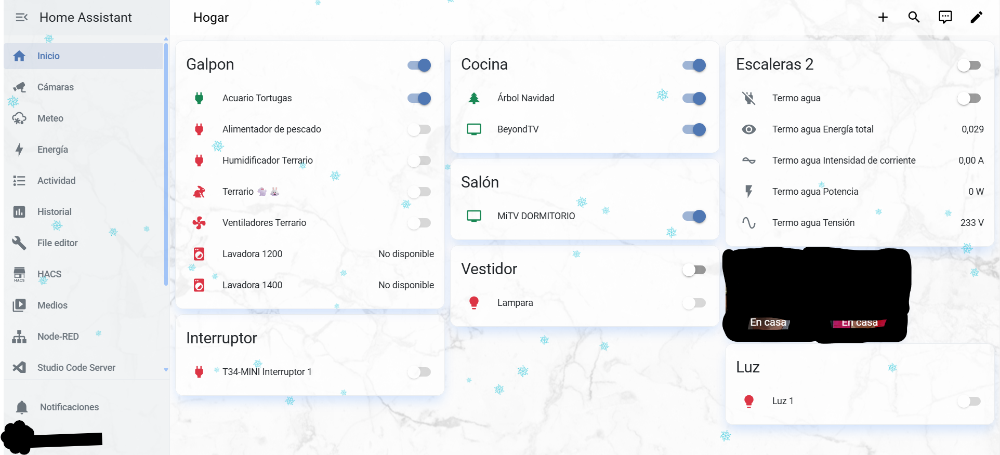
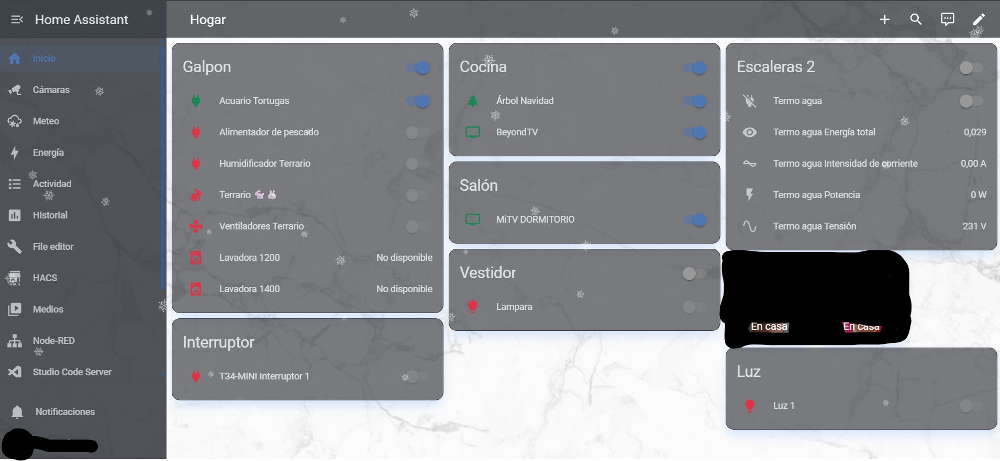
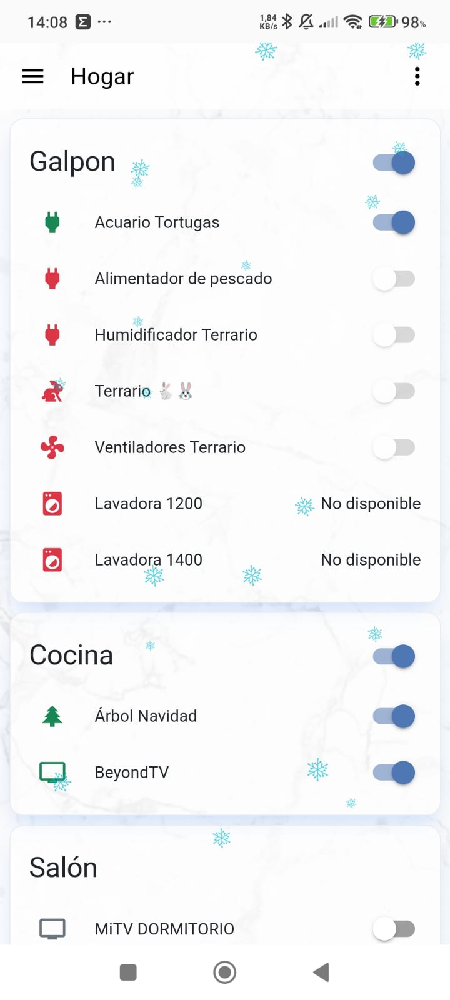
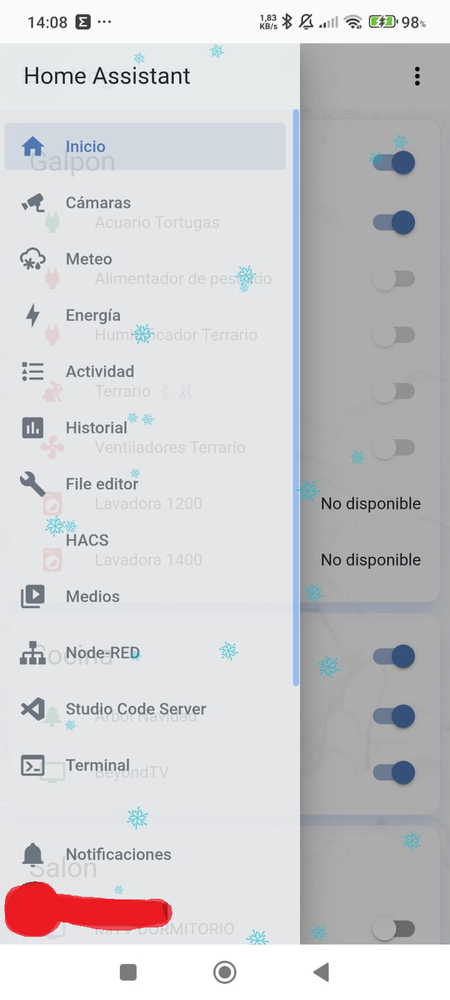
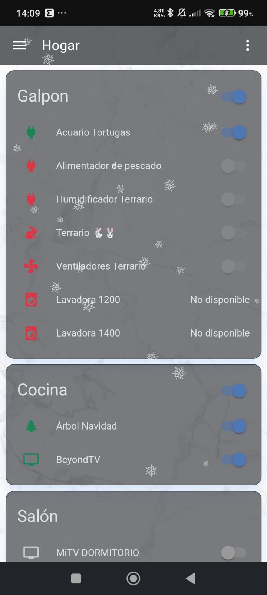
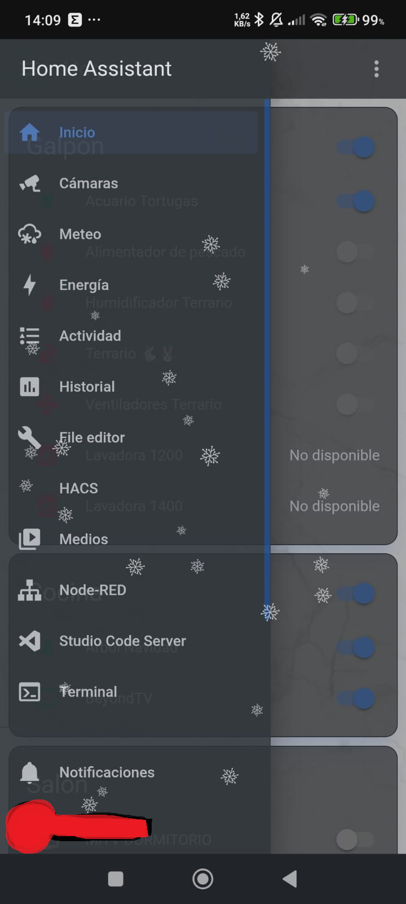

# 🎨 Compos Theme for Home Assistant

Compos es un tema moderno para Home Assistant con estilo **glass / iOS**, fondo con imagen,
colores semánticos y soporte completo para **modo claro y oscuro automático**.

Diseñado para dashboards elegantes, pantallas grandes y móviles.

---

## ✨ Características

- 🌗 Light & Dark mode real (compatible con Auto Dark Mode)
- 🌄 Fondo con imagen propia
- 🧊 Estilo glass (cards, sidebar, header)
- 🎨 Sistema de colores semánticos
- 🔌 Estados por dominio (luces, sensores, media, energía, etc)
- 📊 Energy Dashboard optimizado
- 🧭 Sidebar moderno con hover y selección visual
- 🖱️ Scrollbar y tooltips personalizados

---

## 📸 Preview

*(Imagen de fondo incluida como ejemplo)*

---

## 📂 Instalación manual

1. Copia la carpeta "themes" y "www" a:
/config

2. Asegúrate de tener esto en tu "configuration.yaml":

frontend:
  themes: !include_dir_merge_named themes

3. Reinicia Home Assistant.

4. Ve a:
Perfil → Temas → Selecciona Compos

## 📸 Screenshots

### ☀️ Light mode

### 🌙 Dark mode

### 📱 Mobile ☀️ Light mode

### 📱 Mobile ☀️ Light mode sidebar

### 📱 Mobile 🌙 Dark mode

### 📱 Mobile 🌙 Dark mode sidebar

